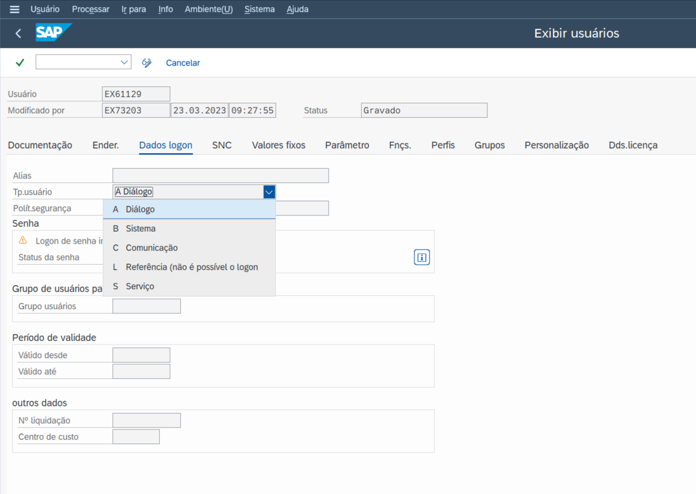
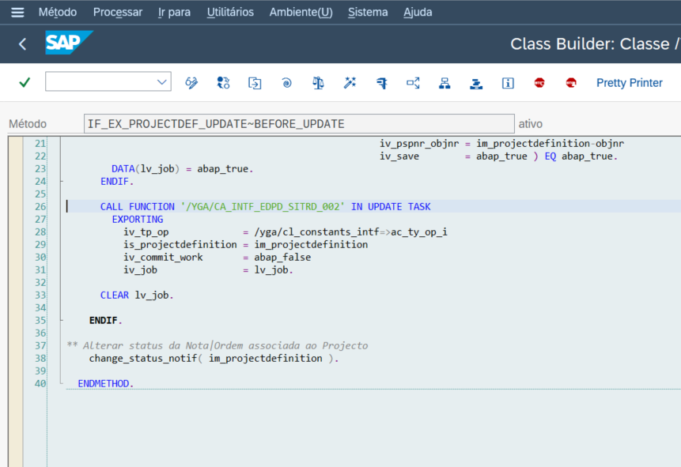
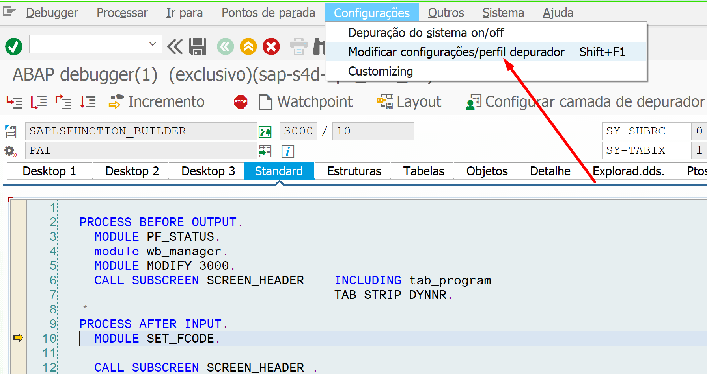
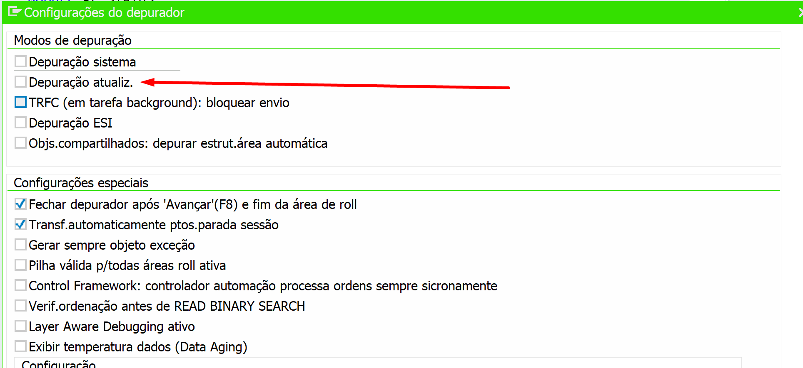
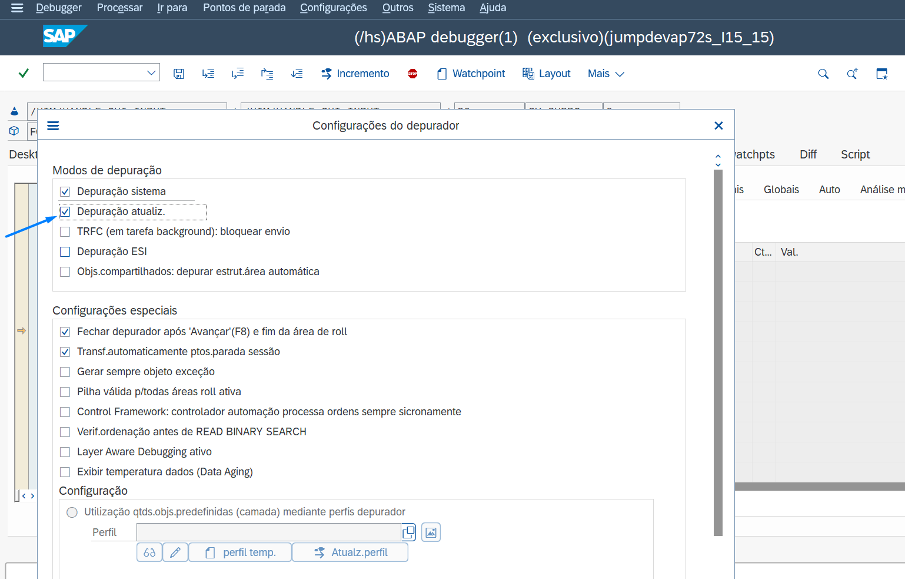
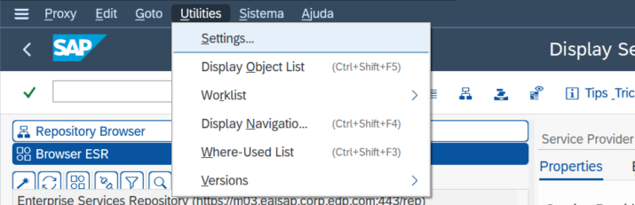
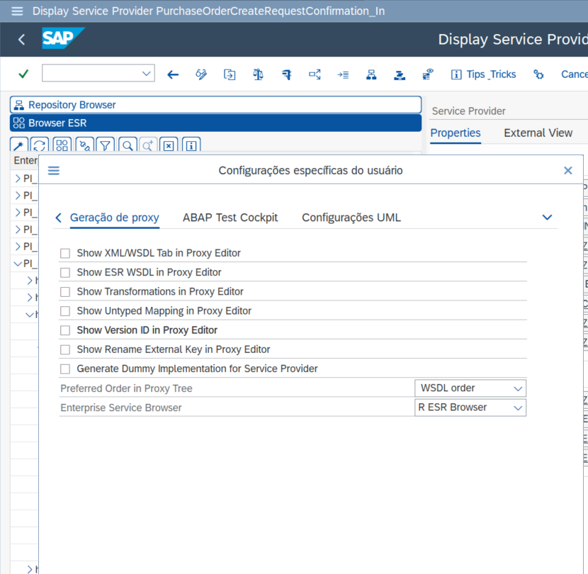

# External Debug / SPROXY Config

~~eu sempre me esqueço das configurações para debug externo e tambem update task, enfim, vou salvar o que Murilo me mostrou para deixar de perguntar 2x vezes por mês a mesma coisa.~~

Existem configurações diferentes para itens diferentes. Um deles para `debug externo` e outro para `update task`. De bonus, tambem vou colocar as config da transação de `SPROXY` ~~que tambem eu sempre esqueço e fico perguntado para o Murilo~~.

## Debug External

Com o código fonte aberto (pela transação `SE38` por exemplo), acessar o menu **Utilitarios > Configurações**.

A tela de configurações abaixo será exibida. Para a o objetivo, é preciso acessar **Editor ABAP > Depuração**. Marcar a opção **Usuário** e informar no campo o usuário que chamará o que SAP externamente, neste caso, `S-PIDI1`, uu seja, o usuário que está configurado no outro sistema.

Após preencher essa informações, basta confirmar no botão **✓ (ok)**.  

Depois de confirmar, basta colocar o `BREAK externo` (que é o que tem o bonequinho ☺).

Obs.: Mas, para isso funcionar, depende da permissão desse usuário externo. Se ele for de `B - Sistema` acho que não faz o debug. Mas quando for colocar o break, o SAP te avisa. Então tem que pedir pra mudar o *TP.Usuário* do usuário pra fazer a depuração.

É necessario uma sessão livre pois ira abrir em uma nova janela.

## Update Task

A sintaxe abaixo é familiar em alguns cenarios e existe uma maneira diferente de executar o debug dessa opção.

Com a necessidade de realizar o debug de funções que tem sintaxe `in update task`, algumas configurações devem ser atualizadas.

Inicie um debug de qualquer programa e deve ir ate o o menu **Configurações > Modificiar configurações/Perfil depurador (shift+1)**.

Na proxima tela, deve ser marcada a opção **Depudação atualiz.**, conforme indicado na imagem abaixo.

Então, a configuração correta passa a ficar da maneira que esta abaixo.

Durante o processamento de um codigo onde existe a chamada de função com o tempo `update task`,  quando passa por ela, o cursor de debug não entra no processamento da função, somente passa (não sei se já percebeu isso).

Se ativar esse parametro (Depuração atualiz.), irá continuar passando e só quando /der F8 (continue) e houver um `commit work`
e epoius que dá F8.. passa um pouquinho e abre outra tela de DEBUG já nas funções de UPDATE TASK
irá vair nessa função.. 

### tem alguma cena de ter uma tela de debug aberta antes disso. tenho que verifiacar

se ativar esse parametro.. 
Murilo Borges de Oliveira, Today at 4:16 PM
Qual o parametro?

só que quando der F8 e der o COMMIt
Murilo Borges de Oliveira, Today at 4:17 PM
Ele joga para outra task, mas so inicia depois do commit, correto?

Murilo, 4:17 PM
isso mesmo.. 

o parametro do }DEBUG.. perae

## SPROXY config
Não menos importante, mas ~~como eu sempre esqueço e tenho que perguntar pro Murilo e nem sempre ele esta de bom humor~~ eu acho importante salvar essas opções para futuramente ter onde procurar essa info.

Acessar a transação `SPROXY` e ir ate o menu **Utilities > Settings**.

Nas opções abaixo, desmarcar todos os ~~piscos~~ flags e escolher as seguintes opções:
- Preferred Order in Proxy Tree: `WSDL order`
- Enterprise Service Browser: `R - ESR Browser`

Após preencher essa informações, basta confirmar no botão **✓ (ok)**.  

Ainda faltam algumas coisas, mas o doc sera atualizado ~~quando eu descobrir o que pode ser~~ em breve.